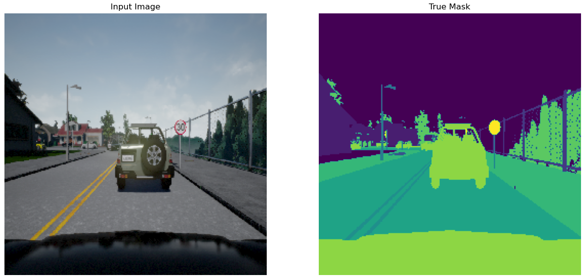
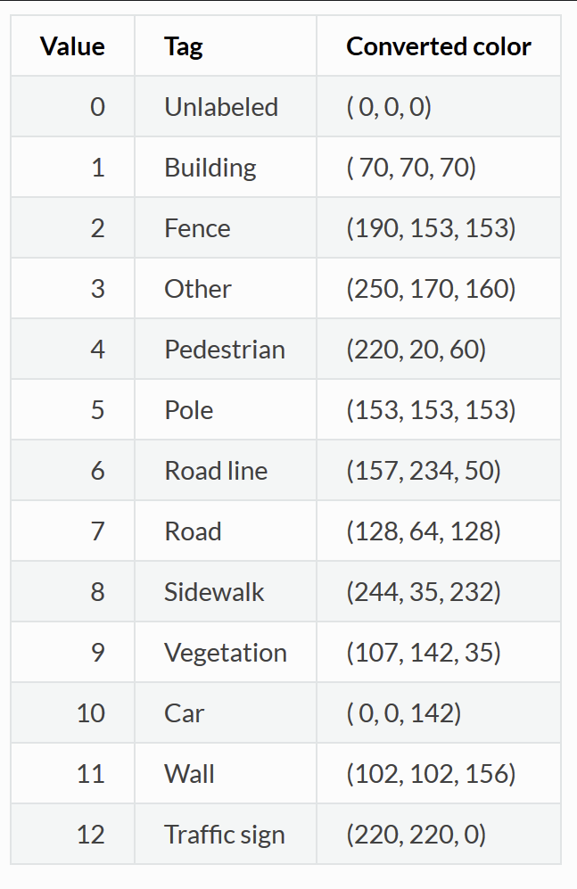
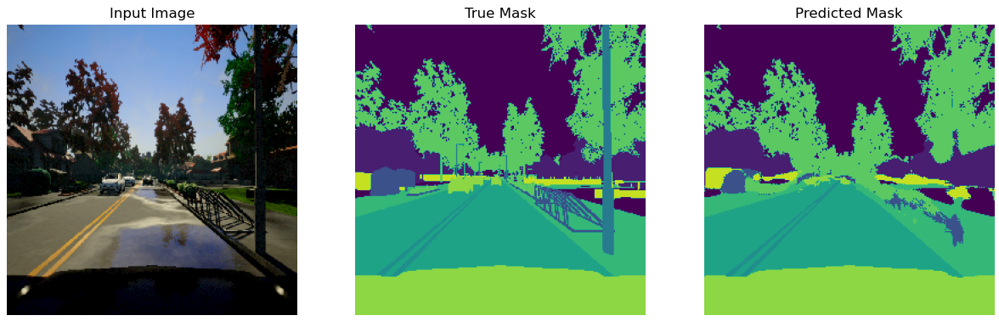
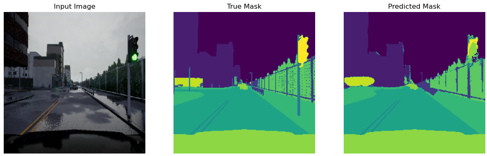
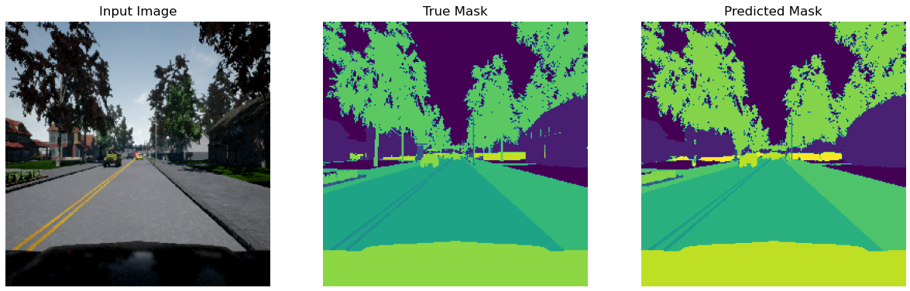

<!-- PROJECT SHIELDS -->

<!--[![Contributors][contributors-shield]][contributors-url] >
<!--[![Activity][activity-shield]][activity-url] >
<!-- [![Stargazers][stars-shield]][stars-url] -->
Eddie 
 

<!-- TABLE OF CONTENTS -->
<details>
  <summary>Table of Contents</summary>
  <ol>
    <li>
      <a href="#business-problem">Business Problem</a>
    </li>
    <li><a href="#data">Data</a></li>
    <li> <a href="#getting-started">Getting Started</a></li>
    <li><a href="#results">Results</a></li>
    <li><a href="#conclusions">Conclusions</a></li>
    <li><a href="#next-steps">Next Steps</a></li>
  </ol>
</details>


<!-- Business Proposal -->
## Business Problem
<div align="center">
<h3 align="center">Semantic Segmentation for Self Driving Cars</h3>
</div>
<p align='center'>
This project aims to produce a deep learning model that is capable of generating segmentation masks from road imagery. By outlining various elements within street imagery(e.g., roads, signage, people), it will allow a self driving vehicle to achieve a better understanding of its surroundings.
</p>
<p align='center'>
 <br>
Image shows an example input image and the accompanying mask with class labels
</p>

## Data
The data was created as part of the Lyft Udacity Challenge and is hosted on Kaggle. It is made up of images taken from the software CARLA, an open-source autonomous driving simulator. The images are made up of a combination of roads, people, signage, cars, etc. 
* [Kaggle](https://www.kaggle.com/datasets/kumaresanmanickavelu/lyft-udacity-challenge/data) 
* [Udacity](https://www.udacity.com/)  

The images are taken from an older version of CARLA, which only had 13 class labels  



## Getting Started

To get a local copy up and running, follow these steps

### Prerequisites
 * Fork repository
    * https://github.com/Zxhjlk/Semantic-Segmentation-for-Self-Driving-Cars/fork
 * GitHub Desktop: used to assess repository for cloning, branching, etc.
	* Download at https://desktop.github.com/ 
	* Login and set repository to forked version  
  
    **OR**
    
* Clone repository through Git Bash:
	```sh
  $ git clone {forked repository}
  ```
 * Conda
 	* Check if Conda is installed in command prompt
	  ```sh
	  conda list
	  ```
 	* Follow instructions on this website to download: https://www.anaconda.com/download/success

### Installation
- Run setup_environment.bat from base directory
- Set kernel as **nn_cars** before running jupyter notebook

## Model Architecture

## Results

### Result1




### Result2



### Result3


## Conclusions
* **Conclusion** Conclusion


## Next Steps
Further steps
* Step1
* Step2

<!-- https://home.aveek.io/GitHub-Profile-Badges/ -->

<!-- LINKS & IMAGES -->
[contributors-shield]: https://img.shields.io/github/contributors/Zxhjlk/Phase3Project.svg?style=for-the-badge
[contributors-url]: https://github.com/Zxhjlk/Phase3Project/graphs/contributors
[activity-shield]: https://img.shields.io/github/last-commit/Zxhjlk/Phase3Project?style=for-the-badge
[activity-url]: https://github.com/Zxhjlk/Phase3Project/activity


[Solidity]: https://img.shields.io/badge/Solidity-363636.svg?style=for-the-badge&logo=Solidity&logoColor=white
[Solidity-url]: https://soliditylang.org/

[Pytorch]: https://img.shields.io/badge/PyTorch-EE4C2C.svg?style=for-the-badge&logo=PyTorch&logoColor=white
[Pytorch-url]: https://pytorch.org/

[React]: https://img.shields.io/badge/React-61DAFB.svg?style=for-the-badge&logo=React&logoColor=black
[React-url]: https://react.dev/

[FastAPI]: https://img.shields.io/badge/FastAPI-009688.svg?style=for-the-badge&logo=FastAPI&logoColor=white
[Fast-url]: https://fastapi.tiangolo.com/