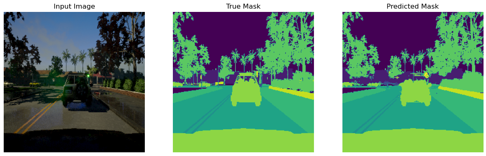

<!-- PROJECT SHIELDS -->

<!--[![Contributors][contributors-shield]][contributors-url] >
<!--[![Activity][activity-shield]][activity-url] >
<!-- [![Stargazers][stars-shield]][stars-url] -->
Eddie 
 

<!-- TABLE OF CONTENTS -->
<details>
  <summary>Table of Contents</summary>
  <ol>
    <li>
      <a href="#business-problem">Business Problem</a>
    </li>
    <li><a href="#data">Data</a></li>
    <li> <a href="#getting-started">Getting Started</a></li>
    <li><a href="#results">Results</a></li>
    <li><a href="#conclusions">Conclusions</a></li>
    <li><a href="#next-steps">Next Steps</a></li>
    <li><a href="#references">References</a></li>
  </ol>
</details>


<!-- Business Proposal -->
## Business Problem
<div align="center">
<h3 align="center">Semantic Segmentation for Self Driving Cars</h3>
</div>
<p align='center'>
This project aims to produce a deep learning model that is capable of generating segmentation masks from road imagery. By outlining various elements within street imagery(e.g., roads, signage, people), it will allow a self driving vehicle to achieve a better understanding of its surroundings.
</p>
<p align='center'>
 <br>
Image shows an example input image and the accompanying mask with class labels
</p>

## Data
The data was created as part of the Lyft Udacity Challenge and is hosted on Kaggle. It is made up of images taken from the software CARLA, an open-source autonomous driving simulator. The images are made up of a combination of roads, people, signage, cars, etc. 
* [Kaggle](https://www.kaggle.com/datasets/kumaresanmanickavelu/lyft-udacity-challenge/data) 
* [Udacity](https://www.udacity.com/)  

The images are taken from an older version of CARLA, which only had 13 class labels  


## Getting Started

To get a local copy up and running, follow these steps

### Prerequisites
 * Fork repository
    * https://github.com/Zxhjlk/Semantic-Segmentation-for-Self-Driving-Cars/fork
 * GitHub Desktop: used to assess repository for cloning, branching, etc.
	* Download at https://desktop.github.com/ 
	* Login and set repository to forked version  
  
    **OR**
    
* Clone repository through Git Bash:
	```sh
  $ git clone {forked repository}
  ```
 * Conda
 	* Check if Conda is installed in command prompt
	  ```sh
	  conda list
	  ```
 	* Follow instructions on this website to download: https://www.anaconda.com/download/success

### Installation
- Run setup_environment.bat from base directory
- Set kernel as **nn_cars** before running jupyter notebook

## Results

### These are the masks created by the baseline model. It struggles a great deal at creating a proper mask, not only with small far away objects such as the cars in the first image, but also larger closer objects such as the traffic light in the first image. This model used Conv2DTranspose for denconvolution but lacked features like regularization techniques to aid in learning.


### The second model greatly improved the structure of the model, adding dropout layers and activation functions to have to model learn more robust features. The generated masks have greatly improved in quality, but it still has some issues with objects farther away. In the second image, it completely misses the top of the car directly infront, and creates poor segmentations for the vehicles further away on the left.




### The final model was very similar in the structure of the model to the second model, except it used Upsampling2D plus Conv2D for the deconvolution. While the quality of the mask is pretty similar to the one predicted by the second model, it seems to be doing better with objects farther away. For example, in the second picture, the segmentation of the cars are very similar to the true mask.


### While accuracy is not a great metric for measuring the performance of models performing semantic segmentation, it is handy to get a quick glance at how these models are performing. We can see that they are all performing quite well, with Upsampling2D and Conv2DTranspose having very similar accuracy. However, to properly measure the performance of these models, a different metric will need to be used. 


### Mean Intersection over Union was the main metric used to measure the performance of these model. It measures the overlap between the predicted and true mask, with a higher number meaning a better match between the two. When we look at the models through this metric, they are performing admirably. The order of the models is still the same, though there is a slightly larger gap now between them. Upsampling2D is still the best performing model. It exhibits a similar pattern in both graphs interestingly, where it struggles to learn initially before shooting up in score.


### Upsampling2D is likely performing better than Conv2DTranspose because it separates the upsampling and feature transformation steps, resulting in less artifacting. Generally this issue arises when the kernel size is not divisible by the stride, but even when this is fixed Conv2DTranspose still has a tendency to create artifacts. The picture below shows the difference. Devoncolution referse to Conv2DTranspose whereas resize-convolution refers to Upsampling2D + Conv2d.[1]


## Next Steps
Further steps
* Use pre-trained models for convolutional steps of semantic segmentation
* Evolve model to work on video segmentation

## References
1. Odena, A., Dumoulin, V., & Olah, C. (2016, October 17). Deconvolution and checkerboard artifacts. Distill. https://distill.pub/2016/deconv-checkerboard/ 